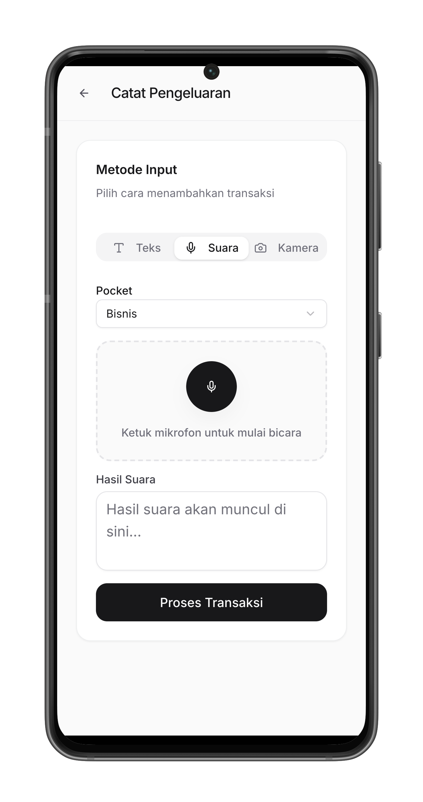
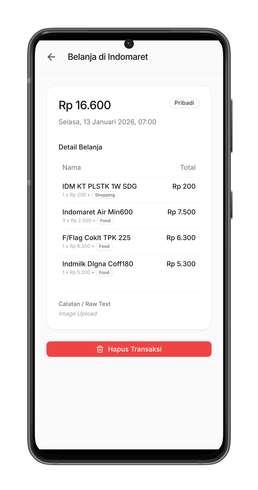
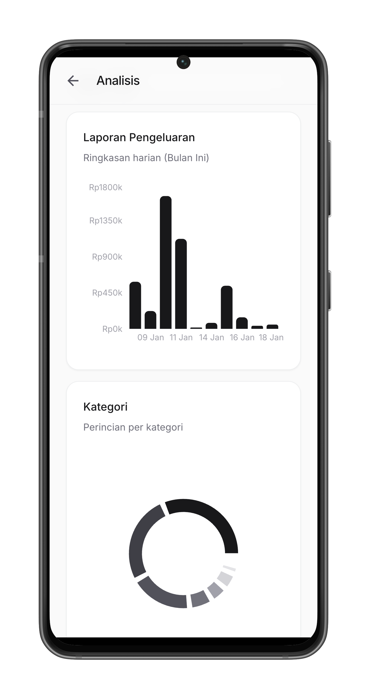

# Expense Tracker

An **AI-powered** personal expense tracking application that uses Large Language Models (LLM) to automatically parse and categorize your expenses from text, voice, or receipt photos.

## AI-Powered Features

This app leverages **any OpenAI-compatible LLM** (OpenAI, Azure OpenAI, local models, etc.) to intelligently process your expenses:

- **Natural Language Input** - Type expenses in plain language (e.g., "Lunch at Starbucks Rp85.000") and let AI extract merchant, amount, and category
- **Voice Recognition** - Speak your expenses and AI transcribes and parses them automatically
- **Receipt OCR** - Snap a photo of any receipt and AI extracts line items, totals, and categorizes each item
- **Smart Categorization** - AI automatically assigns categories (Food, Transport, Shopping, etc.) based on context

## Features

- AI-powered expense parsing via text, voice, or camera
- Automatic item extraction and categorization using LLM
- Google OAuth authentication
- Monthly financial reports with interactive charts
- PWA support for mobile devices
- Pocket sharing for collaborative expense tracking

## Screenshots

<p align="center">
  
  
  
  
</p>

## Tech Stack

- **AI/LLM**: OpenAI-compatible API (GPT, Claude, local models) for natural language processing, receipt OCR, and smart categorization
- **Framework**: Next.js 16 with App Router
- **Database**: PostgreSQL with Drizzle ORM
- **Authentication**: Better Auth with Google OAuth
- **Styling**: Tailwind CSS v4
- **Charts**: Recharts

## Prerequisites

- Node.js 20+
- PostgreSQL database
- **OpenAI-compatible LLM API key** (required for AI-powered expense parsing)
- Google OAuth credentials (optional, for social login)

## Getting Started

### 1. Clone the repository

```bash
git clone <repository-url>
cd finance-tracker
```

### 2. Install dependencies

```bash
npm install
# or
pnpm install
```

### 3. Set up environment variables

Copy the example environment file and fill in your values:

```bash
cp .env.example .env.local
```

Edit `.env.local` with your configuration:

| Variable | Required | Description |
|----------|----------|-------------|
| `NEXT_PUBLIC_BASE_URL` | Yes | Your application URL (e.g., `http://localhost:3000`) |
| `DATABASE_URL` | Yes | PostgreSQL connection string |
| `BETTER_AUTH_SECRET` | Yes | Secret key for session signing (generate with `openssl rand -base64 32`) |
| `GOOGLE_CLIENT_ID` | No | Google OAuth client ID |
| `GOOGLE_CLIENT_SECRET` | No | Google OAuth client secret |
| `OPENAI_API_KEY` | Yes | API key for any OpenAI-compatible LLM provider |
| `OPENAI_BASE_URL` | No | Custom endpoint URL (for Azure, local models, or alternative providers) |
| `OPENAI_MODEL` | No | LLM model to use (e.g., gpt-4, gpt-3.5-turbo, or custom model names) |

### 4. Set up the database

Run database migrations:

```bash
npx drizzle-kit push
```

### 5. Run the development server

```bash
npm run dev
```

Open [http://localhost:3000](http://localhost:3000) with your browser.

## Docker

Build and run with Docker:

```bash
# Build the image
npm run docker:build

# Run the container
npm run docker:run
```

Note: For production, use proper environment variable injection instead of `--env-file`.

## Scripts

| Command | Description |
|---------|-------------|
| `npm run dev` | Start development server |
| `npm run build` | Build for production |
| `npm run start` | Start production server |
| `npm run lint` | Run ESLint |
| `npm run docker:build` | Build Docker image |
| `npm run docker:run` | Run Docker container |

## Project Structure

```
src/
├── app/              # Next.js App Router pages
│   ├── actions/      # Server actions
│   └── api/          # API routes
├── components/       # React components
│   └── ui/           # UI component library
├── db/               # Database schema and config
└── lib/              # Utility functions and config
```

## Security Notes

- Never commit `.env.local` or any file containing secrets
- The `.gitignore` is configured to exclude `.env*` files
- Rotate credentials immediately if accidentally exposed
- Use environment variables in production (via your hosting platform)

## License

MIT
